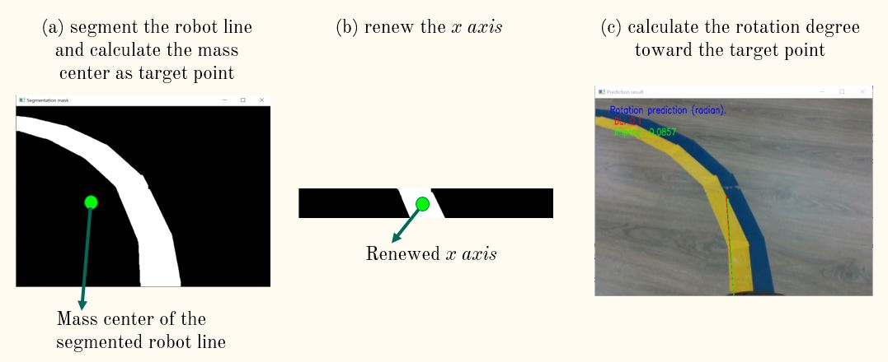

# Line Following Robot
This is the final project for the Deep Learning class lectured by professor Chia-Han Lee in National Chiao Tung University (NCTU), Fall 2020. The objective of the final project is to build a robot to win a line-following competition. This robot has completed the tracks with perfect scores and won first place out of 10 teams. This project used object segmentation techniques for filtering out the line track, and calculates the steering angle and moving speed of the robot. The robot speeds up on straight line tracks and slows down when the curvature of the track is greater than a certain angle.

# Method
This project adopts a traditional image processing approach, which is the image segmentation via HSV image. The input of the robot is a sequence of images captured by its front camera. The line track to follow is composed of yellow and blue lines and the floor is basically all-wooden texture. This method aims at identifying the line track from the image and calculating the cursing direction based on the line segment. 

The method consists of three steps: 

1. Obtain the center of the line track: Mask out the pixels of the background and calculate the geographical center of the line track. 

1. Center adjustment: The calculated center point might not be inside the line track. Following this direction could lead to line track departure. Hence, the center point is horizontally adjusted in this step.

1. Steering angle calculation: The degree between the center point of the line track and the robot is calculated this step.

The details of the method are presented in [this video](https://youtu.be/ocecK87CQw4).

# Demonstration

1. Video demo 1, [click here](https://youtu.be/gqOzMLZzDCs).
2. Video demo 2 (with faster speed), [click here](https://youtu.be/mLA47WiJ1KA).

# Code and Dataset
1. To train and test (infer) the model/algorithm, use `main.py`.
2. To run the robot, use `line_gogo_from_ori.py`.
3. The dataset can be downloaded [here](https://drive.google.com/drive/folders/1zioCeK1OlrUGLt47aBFgAOjNNyN-MEF6?usp=sharing).

# Team Members
Ardian Umam, [Po-Yuan Jeng](https://github.com/lses40311), [Shih-Wei Chiu](https://github.com/chiu0325), and Jeng-Jung Chen.
